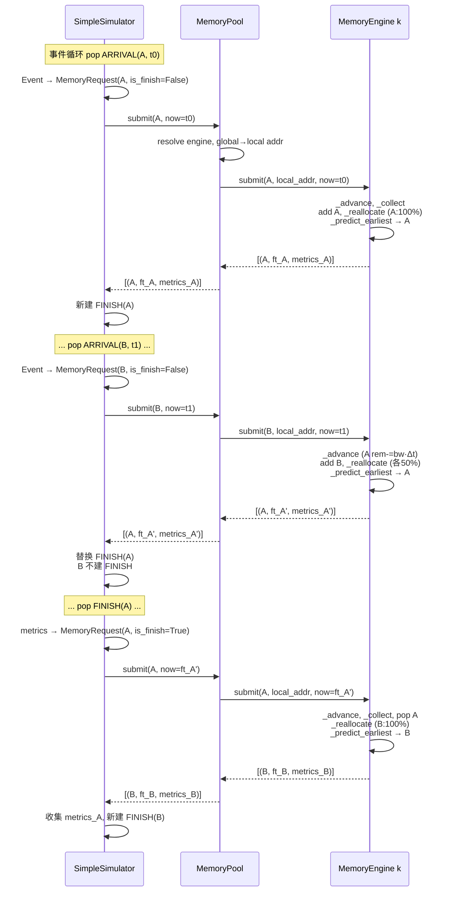

# 多实例管理与理论带宽竞争设计方案

## 1. 文档目的

本文给出 MemEngine 多实例管理和第一阶段访存竞争仿真的完整设计。

本阶段的目标是：

1. 将一个 `MemoryEngine` 明确定义为一个独立的物理介质实例。
2. 通过新的 `MemoryPool` 管理多个 `MemoryEngine`、全局地址和实例路由。
3. 支持多个上层服务实例（例如多个 prefill server）在不同 arrival time 发起访存。
4. 复用当前 Analytic 后端的带宽理论模型，实现事件驱动的动态带宽分配。
5. 向父项目的离散事件仿真器提供与具体事件框架无关的接口。
6. 保留现有单实例同步 `MemoryEngine.issue_request()` 的使用方式。

本阶段不考虑：

- Ramulator/MQSim 的跨调用竞争或在线增量仿真。
- 一个 tensor 跨多个实例进行 stripe 放置。
- 数据复制、迁移、remote request 或缓存一致性。
- PCIe switch、网络、计算单元等多级共享资源的精确流水和仲裁；第一阶段只允许将瓶颈折叠为 Engine 或 Pool 的一个带宽资源。
- 在本仓库内实现完整的全局离散事件循环。

## 2. 核心设计结论

### 2.1 层级划分

- `MemoryEngine`：单个物理介质实例，持有带宽竞争状态（`active_requests`、`last_update_time`、均分带宽）。预测采用**静态公式**（`now + remaining / allocated_bw`），精确度由 FINISH 回调修正。不维护预测缓存或事件指标。
- `MemoryPool`：多实例地址和路由管理层。`submit(request, now)` 处理 ARRIVAL，`finish(rid, engine_id, now)` 处理 FINISH 回调。不 import `Event`。
- `SimpleSimulator`：事件堆管理 + 最终统计。ARRIVAL 调 `pool.submit()`，FINISH 调 `pool.finish()`。**只有最早完成的请求持有 FINISH 事件**。

### 2.2 从 MemoryEngine 移出的职责

多实例改造完成后，下列职责不再属于 `MemoryEngine`：

- `dp_size` 和 DP 请求复制。
- `storage_instance_num`。
- 跨实例 round-robin。
- 池级全局地址空间。
- 池级全局请求计数。

DP 语义应由上层 workload 或父项目服务拓扑表达；多实例数量、地址空间和请求路由由 `MemoryPool` 表达。

### 2.3 地址语义

- 直接调用 `MemoryEngine` 时，地址是该实例的 local byte address。
- 通过 `MemoryPool` 调用时，地址始终是 pool global byte address。
- `MemoryPool.submit()` 可以选择性携带 `mem_engine_id`，但该参数只用于直接定位和归属校验，不改变 `addr` 的 global address 语义。
- 未指定 `mem_engine_id` 时，根据 global address 所在的实例地址窗口进行确定性路由。
- 实例选择发生在数据分配时，而不是每次访问时，避免同一个地址被动态发送到不同实例。

## 3. 整体架构图

```mermaid
flowchart TB
    subgraph SERVICE["上层服务实例"]
        P0["Prefill Server 0"]
        P1["Prefill Server 1"]
        PN["Prefill Server N"]
    end

    subgraph PARENT["父项目离散事件仿真器"]
        DES["SimpleSimulator (或父项目 DES)<br/>事件队列、逐个下发 ARRIVAL、<br/>接收 FINISH 事件列表并替换"]
        ARRIVE["Arrival Events"]
        FINISH["Finish Events (with embedded metrics)"]
        ARRIVE --> DES
        FINISH --> DES
    end

    subgraph POOL_LAYER["MemoryPool：多实例系统层"]
        API["submit(request, now) / get_tensor_addr"]
        ADDR["Global Address Windows<br/>Allocation Policy"]
        ROUTER["Global -> Engine ID + Local Address"]
        API --> ADDR
        ADDR --> ROUTER
    end

    subgraph ENGINE_LAYER["MemoryEngine：单实例层"]
        E0["MemoryEngine 0<br/>local allocator, active requests,<br/>bandwidth state, predictions"]
        E1["MemoryEngine 1<br/>local allocator, active requests,<br/>bandwidth state, predictions"]
        EM["MemoryEngine M<br/>local allocator, active requests,<br/>bandwidth state, predictions"]

        B0["Analytic / Ramulator / MQSim backend 0"]
        B1["Analytic / Ramulator / MQSim backend 1"]
        BM["Analytic / Ramulator / MQSim backend M"]

        E0 --> B0
        E1 --> B1
        EM --> BM
    end

    P0 --> DES
    P1 --> DES
    PN --> DES
    DES --> API
    ROUTER --> E0
    ROUTER --> E1
    ROUTER --> EM
    E0 -.->|[(rid, ft, metrics)]| API
    E1 -.->|[(rid, ft, metrics)]| API
    EM -.->|[(rid, ft, metrics)]| API
```

每个 Engine 独立管理自己的带宽竞争状态。第一阶段只有 Analytic backend 接入事件驱动路径，Ramulator 和 MQSim 保持同步 batch 模式。TODO(phase-2): POOL scope（共享带宽）。

## 4. 模块职责

| 模块 | 核心职责 | 不负责的内容 |
| --- | --- | --- |
| `MemoryEngine` | 单实例 local 地址分配、容量校验、backend 生命周期；持有带宽竞争状态（`_advance`、`_pop_finished`、`_reallocate`、`_predict_earliest`、`_build_results`） | 多实例数量、跨实例路由、DP 复制、事件队列、最终统计 |
| `MemoryPool` | 实例集合、global 地址窗口、global→local 转换、`submit(request, now)`（ARRIVAL）+ `finish(rid, engine_id, now)`（FINISH）；不做统计 | DRAM/NAND 细节、引擎内部带宽状态、事件队列管理、Event |
| `SimpleSimulator` | 管理事件堆（Event 带 callback）；`schedule_arrival` 用闭包构造回调；`run()` 直接 `event.callback()`；聚合 makespan 和 per-source 指标 | 地址映射、介质请求转换、engine 身份 |
| `des/event.py` | `Event`：`time` + `callback` + `request_id` + `metrics`；无 `EventKind` | — |

## 5. 多实例和地址空间设计

### 5.1 固定全局地址窗口

第一阶段为每个 MemEngine 分配一个互不重叠的 global address window。

假设实例容量为 `C0`、`C1`、`C2`：

```text
MemEngine 0: global [0,       C0)
MemEngine 1: global [C0,      C0+C1)
MemEngine 2: global [C0+C1,   C0+C1+C2)
```

对于实例 `i`：

```text
global_addr = global_base[i] + local_addr
local_addr  = global_addr - global_base[i]
```

实例可以通过对窗口起始地址进行二分查找，或在同构等容量时通过除法快速定位。实现上优先使用统一的窗口表，以便以后支持异构容量。

### 5.2 地址分配

池级接口：

```python
def get_tensor_addr(
    self,
    size_bytes: int,
    *,
    mem_engine_id: int | None = None,
) -> tuple[int, int]:
    """Allocate and return (global_addr, engine_id)."""
```

处理流程：

1. 如果指定 `mem_engine_id`，选择对应实例。
2. 如果未指定，由 pool allocation policy 选择实例。
3. 调用目标 `MemoryEngine.get_tensor_addr()` 分配 local address。
4. 将 local address 转换为 global address 并返回。

当前默认 ROUND_ROBIN：从上次选中的引擎开始扫描，选第一个剩余容量足够的。不支持 LEAST_ALLOCATED。

TODO(phase-2): 可插拔分配策略。

### 5.3 为什么不需要 MemoryRegion

第一阶段规定：

- 一个 allocation 完整落在一个 MemEngine。
- 一次访问不能跨越两个实例的 global window。
- 不支持 stripe、迁移或副本。

因此仅使用 global/local address 和固定窗口即可，不需要 `MemoryRegion`、`MemoryRegionSegment` 或地址片段表。如果后续支持跨实例 stripe，再单独引入这些结构。

### 5.4 地址访问校验

`MemoryPool.submit()` 必须校验每个 arrival 的地址：

- `addr >= 0`。
- `size_bytes > 0`。
- `[addr, addr + size_bytes)` 完整位于某个实例窗口内。
- 如果指定 `mem_engine_id`，地址窗口必须属于该实例。
- local address 转换后不能超过实例容量。

不允许指定一个实例 ID，却用另一个实例窗口中的地址静默访问。

### 5.5 一个请求只访问一个存储节点

第一阶段中，MemoryPool 的策略是数据 placement 策略，而不是每次访问时的负载均衡策略：

```text
一次 allocation      -> 一个 MemoryEngine
一次 memory request  -> 数据所属的一个 MemoryEngine
```

请求不会因为当前实例繁忙而动态发送到其他实例。只有后续显式支持 stripe、数据副本或迁移时，一个逻辑请求才可能拆分到多个存储节点。

### 5.6 介质带宽

每个 Engine 拥有独立的带宽资源，直接使用配置的 `bandwidth`（GB/s）。不区分介质带宽和传输链路带宽——如需建模传输瓶颈，可调节配置的 bandwidth 值。

TODO(phase-2): 如果目标硬件共享传输链路，需引入 POOL scope（共享带宽资源）。

## 6. 核心数据结构和接口

### 6.1 MemoryRequest — 统一请求类型

事件路径和同步路径共用 `MemoryRequest`。取代了旧的 `MemoryRequest` 和 `MemoryObject`：

```python
@dataclass
class MemoryRequest:
    addr: int                       # 地址
    size: int                       # 字节数（属性 size_bytes 为别名）
    req_type: MemoryRequestType     # 读写类型
    media_req_num: int = 0          # 按 granularity 分解的估计数量
    media_request_list = []         # 分解后的介质请求（由 backend 填充）

    # 事件路径字段
    request_id: str = ""
    source_id: str = ""
    mem_engine_id: int | None = None

    # Engine mutable state (event path)
    arrival_time: float = 0.0
    remaining_bytes: float = 0.0
    allocated_bandwidth: float = 0.0
    metrics: Optional[MemoryRequestMetrics] = None
```

- ARRIVAL 时 Simulator 构造 `MemoryRequest`
- FINISH 时 Simulator 调 `pool.finish(rid, engine_id, now)`，不构造 MemoryRequest
- Engine 在预测时给 `request.metrics` 赋值，返回 `List[MemoryRequest]`

`MemoryRequest` 和 `MemoryObject` 已删除。

### 6.2 MemoryRequestMetrics

每次预测时预计算并嵌入返回值的单请求指标：

```python
@dataclass(frozen=True)
class MemoryRequestMetrics:
    request_id: str
    source_id: str
    mem_engine_id: int
    arrival_time: float
    finish_time: float
    size_bytes: int
    latency: float
    standalone_time: float
    contention_delay: float
    average_bandwidth: float
```

其中：

```text
latency           = finish_time - arrival_time
standalone_time   = size_bytes / B_effective
contention_delay  = latency - standalone_time
average_bandwidth = size_bytes / latency
```

### 6.3 Event：回调驱动的离散事件

```python
@dataclass(frozen=True)
class Event:
    time: float
    callback: Callable[[], None]       # 触发时执行的回调
    request_id: str
    metrics: Optional[MemoryRequestMetrics] = None
    seq: int = 0                        # 同时间事件排序用
```

`EventKind` 删除——ARRIVAL 和 FINISH 的区别体现在 `callback` 函数体内，不需要枚举判断。

Simulator 在 `schedule_arrival` 和 `_handle_finish` 中通过闭包构造正确的回调：

```python
def schedule_arrival(...):
    def _on_arrival():
        request = MemoryRequest(...)
        entries = self._pool.submit(request, now=time)
        self._refresh_finish_events(entries)
    ev = Event(time=time, callback=_on_arrival, request_id=request_id, ...)
    heapq.heappush(...)

def _refresh_finish_events(self, entries):
    for rid, ft, metrics in entries:
        def _on_finish():
            self._request_metrics.append(metrics)
            request = MemoryRequest(..., is_finish=True, ...)
            updated = self._pool.submit(request, now=ft)
            self._refresh_finish_events(updated)
        ev = Event(time=ft, callback=_on_finish, request_id=rid, metrics=metrics)
        heapq.heappush(...)
```

`run()` 简化为：

```python
while self._heap:
    event = heapq.heappop(self._heap)[2]
    event.callback()
```

### 6.4 统一 submit，最早完成者先行

Simulator 对 ARRIVAL 和 FINISH 走同一个 `pool.submit(request, now)`。Engine 根据 ``pool.finish()`` 区分：

```
ARRIVAL:
  Simulator: Event → MemoryRequest(is_finish=False)
  pool.submit(request, now) → engine: advance, add, reallocate, _predict_earliest
    → return [(earliest_rid, ft, metrics), ...]

FINISH:
  Simulator: 从 event.metrics 构造 MemoryRequest(is_finish=True, rid, eng_id, size)
  pool.submit(request, now) → engine: advance, pop, reallocate, _predict_earliest
    → return [(next_earliest, ft, metrics), ...]
```

**核心不变式**：每个活跃请求最多一个 FINISH，且只有最早完成的持有。精确度由 FINISH 时的 reallocate 保证。

### 6.5 Pool 接口

```python
def submit(
    self, request: MemoryRequest, *, now: float,
) -> list[tuple[str, float, MemoryRequestMetrics]]:
    """统一入口。"""
```

路由规则：

| 条件 | 处理 |
|---|---|
| FINISH 回调 | `pool.finish(rid, engine_id, now)` → `get_engine(engine_id)` |
| `request.req_type == KWRITE` (addr=None) | `get_tensor_addr(size, mem_engine_id)` → `get_engine(engine_id)` |
| 其它（KREAD） | `_validate_request` 二分查找窗口 |

`get_tensor_addr` 返回 `(global_addr, engine_id)`。写请求通过它分配空间并扣容量，读请求使用预先分配的地址。
```

## 7. 基于当前 Analytic 后端实现动态竞争

### 7.1 复用而不是重写

当前 Analytic 后端的核心公式是：

```text
total_time = total_bytes / configured_bandwidth
```

事件驱动模型使用同一公式和同一带宽配置（`media_system._bandwidth_bytes_per_sec`），只增加跨事件状态。

### 7.2 引擎内部状态

Engin 直接在实例上维护带宽竞争状态，不设独立的事件队列类，不维护预测缓存或事件指标：

```python
class MemoryEngine:
    _active_requests: dict[str, MemoryRequest]
    _last_update_time: float
    _runtime_mode: str | None
```

预测用静态公式 `now + remaining / allocated_bw`，精度由 FINISH 回调修正。

### 7.3 动态带宽推进

**`submit(request, local_addr, now)`** — 统一切入口：

1. `_advance(now)` + `_pop_finished()`
2. 若 ``pool.finish()``：pop 指定 rid
  否则：校验 rid 不重复，创建 `ActiveMemoryRequest` 加入 `_active_requests`
3. `_reallocate()` — 均分带宽
4. `_predict_earliest(now)` — 静态预测，筛选 `ft == min(ft)` 的最早者返回

`notify_finish` 删除——统一到 `submit`。

### 7.4 带宽共享

第一阶段固定均分：`share = peak / n`，直接写在 engine 的 reallocate 逻辑中。

TODO(phase-2): 加权分配、source-fair 分配（需在 `MemoryRequest` 中增加 `weight` 字段）。

### 7.5 理论不变量

实现应至少满足：

1. 单请求无竞争：

   ```text
   completion - arrival = bytes / peak_bandwidth
   ```

2. 所有请求同时到达且模型 work-conserving：

   ```text
   final_makespan = sum(all_bytes) / peak_bandwidth
   ```

   该结果应与当前 Analytic batch 后端一致。

3. 任意非空 active 集合：

   ```text
   sum(allocated_bandwidth_i) = peak_bandwidth
   ```

   允许浮点误差。

4. `remaining_bytes` 不得为负。
5. arrival time、finish time 和 `last_update_time` 必须单调不减。

## 8. 上层离散事件调用流程

### 8.1 整体事件关系时序图



**三层隔离**：
- **SimpleSimulator**：管理事件堆。Event 带 callback 闭包，`run()` 直接 `event.callback()`。ARRIVAL 调 `pool.submit(request, now)`，FINISH 调 `pool.finish(rid, engine_id, now)`。
- **Pool**：`submit` + `finish` 分路路由。不做统计。
- **Engine**：`submit()`：`_advance` → `_pop_finished` → add → `_reallocate` → `_predict_earliest` → `_build_results`（返回 `List[MemoryRequest]`，每项带 `metrics`）。`finish()`：`_advance` → `_pop_finished` → pop → `_reallocate` → `_predict_earliest` → `_build_results`。

**关键设计点**：
- **惰性删除**：`_refresh_finish_events` 不扫描堆，通过 `_latest_finish` dict O(1) 记录最新预测。旧 FINISH 在 pop 时被跳过。
- **最早完成者先行**：只有最早完成的请求持有 FINISH。后续者在 FINISH 回调中补建。
- **FINISH 回调修正精度**：初始预测可能悲观，但每次完成释放带宽后重算。

### 8.2 初始化

```python
pool = MemoryPool(instance_count=4, engine_config=engine_config)
```

### 8.3 分配数据

```python
addr, _ = pool.get_tensor_addr(kv_size_bytes)
addr, _ = pool.get_tensor_addr(kv_size_bytes, mem_engine_id=2)
```

### 8.4 父项目事件处理伪代码

```python
class SimpleSimulator:
    def __init__(self, pool):
        self._pool = pool
        self._heap: list[tuple[float, int, Event]] = []
        self._seq = 0
        self._request_metrics: list[MemoryRequestMetrics] = []

    def _handle_arrival(self, event):
        request = MemoryRequest(
            addr, size_bytes, req_type,
            request_id=event.request_id,
            source_id=event.source_id,
            mem_engine_id=engine_id,
        )
        self._refresh_finish_events(
            self._pool.submit(request, now=event.time))

    def _handle_finish(self, event):
        if event.metrics is not None:
            self._request_metrics.append(event.metrics)
        self._refresh_finish_events(
            self._pool.finish(event.request_id,
                              event.metrics.mem_engine_id, event.time))

    def _refresh_finish_events(self, entries):
        for req in entries:
            m = req.metrics
            rid = m.request_id
            ft = m.finish_time
            # 惰性删除：记录最新预测时间，旧 FINISH 在 pop 时跳过
            self._latest_finish[rid] = ft

            def _on_finish():
                self._request_metrics.append(m)
                self._refresh_finish_events(
                    pool.finish(rid, m.mem_engine_id, ft))

            self._push_event(Event(time=ft, callback=_on_finish,
                                   request_id=rid, metrics=m))
```

**惰性删除原理**：`_refresh_finish_events` 不扫描堆——只记录 `_latest_finish[rid] = ft` 然后 `heappush`。旧 FINISH 留在堆中，`run()` pop 时通过 `event.time == _latest_finish[rid]` 校验，不匹配则跳过。O(1) push，O(log n) pop。

### 8.5 Engine 内部状态管理

**`submit(request, now=t)`** — ARRIVAL：

1. `_advance(t)` + `_pop_finished()`
2. 创建 `MemoryRequest` 加入 `_active_requests`
3. `_reallocate()` + `_predict_earliest(now)` + `_build_results(predictions)`
4. 返回 `List[MemoryRequest]`（每项带 `metrics`，最早完成者）

**`finish(rid, now)`** — FINISH 回调：

1. `_advance(now)` + `_pop_finished()` + pop rid
2. `_reallocate()` + `_predict_earliest(now)` + `_build_results(predictions)`
3. 返回 `List[MemoryRequest]`（下一批最早完成者）

## 9. 同步接口与事件接口的关系

### 9.1 保留单实例同步兼容

现有调用保持：

```python
engine = MemoryEngine(engine_config)
addr = engine.get_tensor_addr(size)
metrics = engine.issue_request([addr], [size], [req_type])
```

同步 `issue_request()` 使用 local address，调用现有 backend batch 模式，不产生 arrival 或 active request 竞争状态。

### 9.2 禁止混用运行模式

同一个仿真 session 中同一 engine 不应混用：

- `issue_request()`（同步执行）；
- `pool.submit()` / `engine.submit()`（事件驱动执行）。

首次调用锁定该 engine 的 runtime mode（sync / event），混用抛 `RuntimeError`。

## 10. 指标设计

Engine 只维护同步路径的 `MemoryEngineMetrics`（`issue_request` 的累计指标）。事件路径不做引擎侧统计——最终指标完全由 Simulator 持有：

- **`MemoryRequestMetrics`**：单个完成请求的指标，在 engine 预测时预计算，嵌入 FINISH 事件。Simulator 在 FINISH 触发时收集到 `SimulationResult.request_metrics`。
- **`SimulationResult`**：`run()` 的输出，包含全部 `request_metrics`、per-source 聚合（avg_latency、avg_contention_delay、total_bytes、count）、makespan。

Pool 和 Engine 都不维护事件路径的累计计数器（`MemoryPoolMetrics`、`EngineEventMetrics`、`BandwidthAllocation` 均已删除）。

### 10.4 结果输出

`SimulationResult` 提供两个导出方法：

```python
result = sim.run()
result.save_json("output/des_result.json")   # 机器可读
result.save_html("output/des_result.html")   # 可视化报告
```

`output/` 目录已加入 `.gitignore`。HTML 报告自包含，双击浏览器直接查看：

- **概览卡片**：makespan、请求数、stale 事件数
- **Gantt 图**：按 engine 分组，显示每个请求的到达/完成时间线，绿色=standalone，橙色=contention
- **Latency Breakdown 柱状图**：standalone_time 和 contention_delay 堆叠
- **Per-Source 汇总表**：avg_latency、total_bytes、count
- **悬停工具**：鼠标悬停显示 arrival_time、finish_time、latency、standalone、contention

## 11. 对当前代码的改动

### 11.1 `memory_engine.py`

主要改动：

- 删除 DP 展开和 `storage_instance_num` round-robin。
- 地址空间改为单实例 local address。
- 保留 `get_tensor_addr()`、`issue_request()`（同步路径）和 `media_system`。
- 增加 `instance_id`、`global_base` 等由 Pool 注入的实例元数据。
- 事件驱动状态：`submit(request, local_addr, now)` 统一入口，根据 ``pool.finish()`` 分支（ARRIVAL: add + reallocate；FINISH: pop + reallocate）。`_predict_earliest` 筛选最早完成者。

### 11.2 `memory_config.py`

建议：

- 从 `MemoryEngineConfig` 移除或弃用 `dp_size`。
- 从 `MemoryEngineConfig` 移除或弃用 `storage_instance_num`。
- `capacity` 明确定义为单实例容量。
- 增加 `MemoryPoolConfig`：实例数量、allocation policy。
- 增加 media bandwidth 和 effective bandwidth 的明确配置与派生。

兼容迁移可以分两步：

1. 暂时保留旧字段，只允许值为 1，并发出 deprecation warning。
2. 文档和配置迁移完成后删除字段。

### 11.3 `memory_pool/pool.py`

包含：

- `MemoryPool`：constructor 直接接收 `instance_count + engine_config`（仅同构）。`get_tensor_addr()` 从 RR 位置扫描，选第一个容量足够的。`submit(request, now)` 统一入口（校验→resolve→forward）。
- `AllocationPolicy` 枚举已删除；ROUND_ROBIN 硬编码，留 TODO。

### 11.4 新增数据契约

`memory_pool/request_metrics.py`：

- `MemoryRequestMetrics`：单个完成请求的指标，在预测时预计算。

`des/event.py`：

- `Event`：`time` + `callback` + `request_id` + `metrics`，无 `EventKind`。Simulator 通过闭包注入回调逻辑，`run()` 直接 `event.callback()`。

### 11.5 事件驱动竞争实现

带宽竞争状态（`_advance`、`_pop_finished`、`_reallocate`、`_predict_earliest`、`_build_results`）内置于 `MemoryEngine`。`submit` 统一 ARRIVAL/FINISH。带宽固定均分（`peak / n`）。TODO(phase-2): 可配置带宽分配策略。

### 11.7 `memory_metrics.py`

- `MemoryEngineMetrics` 单实例累计口径（同步路径）。
- `MemoryRequestMetrics` 在 `memory_pool/request_metrics.py` 中定义。
- 删除 `EngineEventMetrics`、`SourceTrafficMetrics`、`MemoryPoolMetrics`、`InstanceMetricsSummary`、`BandwidthAllocation`。

### 11.8 `run.py`

- `instances=1` 时仍可直接创建 `MemoryEngine`，或统一创建单实例 `MemoryPool`。
- `instances>1` 时创建 `MemoryPool`，不能再将实例数传给单个 Engine。
- 状态栏显示单实例容量、pool 总容量、allocation policy。
- KV workload 通过 Pool 分配 global address 后提交。

### 11.9 workload

KV workload generator 仍只负责生成 byte address、byte size 和 request type，不直接依赖 contention 或 backend。

需要调整的是调用位置：

- 单实例测试继续使用 local address 和 `MemoryEngine`。
- 池化 workload 使用 `MemoryPool.get_tensor_addr()` 返回的 global address。
- DP 复制若仍需要，由父项目或 workload 调用层显式生成。

### 11.10 Ramulator/MQSim

第一阶段不修改竞争行为：

- wrapper 接口保持 batch 模式。
- 不向它们连续注入带 arrival time 的请求。
- 不基于多次独立调用推导 native 竞争。
- event-driven `submit()` 遇到非 Analytic backend 时抛出明确的 `NotImplementedError` 或能力错误。

## 12. 配置语义调整

建议的新配置概念：

```json
{
  "mem_pool": {
    "instances": 4
  },
  "engine": {
    "media_type": "analytic",
    "capacity_per_instance_gib": 32.0,
    "bandwidth_per_instance_gib_s": 400.0
  }
}
```

关键变化：

- 容量和 media bandwidth 是 per-instance 参数。
- pool 总容量由实例容量求和。
- 旧配置 `instances=1` 可自动迁移。
- 旧配置若 `instances>1`，当前 `capacity` 曾表示总容量，不能静默解释为单实例容量；应要求用户明确给出 `capacity_per_instance_gib`，或者由兼容加载器按旧口径除以实例数并打印醒目警告。

## 13. 测试方案

### 13.1 MemoryEngine 单实例回归

- 地址对齐和容量溢出。
- 单请求和多请求 batch Analytic 结果不变。
- Ramulator/MQSim 现有单实例测试不受影响。
- `dp_size`、`storage_instance_num` 弃用行为符合预期。

### 13.2 MemoryPool 地址测试

- 同构和异构容量窗口。
- 指定实例分配。
- 未指定实例的 round-robin/least-allocated。
- global/local 地址转换。
- 地址恰好位于窗口边界。
- 请求跨窗口时拒绝。
- 指定错误 `mem_engine_id` 时拒绝。
- 所有实例容量不足时给出清晰异常。

### 13.3 动态带宽测试

- 单请求结果等于当前 Analytic。
- 所有请求同时到达时 final makespan 等于总字节除以峰值带宽。
- 第二个请求到达前，第一请求按全带宽推进。
- 新 ARRIVAL 到达后带宽均分，预测完成时间推迟。
- submit 返回全部活跃请求的预测 `[(rid, finish_time, metrics), ...]`。
- 多个同时间 arrival 与调用顺序无关。
- 浮点边界下 remaining bytes 不为负。
- advance + _pop_finished 自动清理已完成请求。

### 13.4 多实例竞争测试

- 不同实例上的请求互不影响。
- 同一实例、不同 source 的请求发生带宽竞争。
- 每个实例有独立的 `last_update_time` 和 active request 状态。
- TODO(phase-2): Pool shared link 下不同实例请求竞争同一带宽。
- pool metrics 等于各实例统计的正确聚合。

### 13.5 父项目接口契约测试

使用 `SimpleSimulator` 验证：

1. 逐个 `schedule_arrival()` 后 `sim.run()` 返回正确的结果。
2. `pool.submit()` 返回正确的 `[(rid, finish_time, metrics), ...]`。
3. 新 ARRIVAL 后旧 FINISH 按 `request_id` 匹配被正确替换。
4. FINISH 触发时从 `event.metrics` 直接收集，不调 pool。
5. 同一 engine 上混用 `engine.submit()`（事件）和 `engine.issue_request()`（同步）抛 `RuntimeError`。
6. `memory_pool` 不 import `des`。

## 14. 建议实施阶段

### 阶段一：单实例职责清理

- 清理 `MemoryEngine` 的 DP 和伪多实例逻辑。
- 保持单实例同步 API。
- 明确单实例容量和指标口径。

### 阶段二：MemoryPool

- 实现固定 global address window。
- 实现实例分配和 global/local 转换。
- 实现池级 `submit()` 事件接口。
- 实现 pool metrics。

### 阶段三：事件驱动竞争

- 在 `MemoryEngine` 中实现 `_advance`、`_pop_finished`、`_reallocate`、`_predict_earliest`。
- 带宽固定均分（`peak / n`）。`submit` 统一 ARRIVAL/FINISH（``pool.finish()`` 分支）。
- Event：回调驱动，无 `EventKind`。`run()` 直接 `event.callback()`。
- `SimpleSimulator` 管理 FINISH 事件堆，按 `request_id` 匹配替换。

### 后续阶段

- **可配置带宽分配策略**：在 `MemoryRequest` 中恢复 `weight` 字段，增加 `WeightedTransferShare` 和 `SourceFairShare`，通过 `sharing_policy` 配置项选择。
- POOL 作用域（共享带宽资源）：跨 engine 事件协调。
- 读写分别限速或共享/全双工策略。
- 请求取消和超时。
- 跨实例 stripe、迁移和副本。
- 带 arrival time 的 Ramulator/MQSim native trace。

## 15. 最终边界

本方案完成后：

- `MemoryEngine`：内部 `_advance` / `_pop_finished` / `_reallocate` / `_predict_earliest` / `_build_results`。`submit(request, now)`（ARRIVAL）、`finish(rid, now)`（FINISH），返回 `List[MemoryRequest]`（带 `metrics`）。同步 `issue_request()` 保留。
- `MemoryPool`：`submit(request, now)` + `finish(rid, engine_id, now)`。不做统计。
- `SimpleSimulator`：ARRIVAL 调 `pool.submit()`，FINISH 调 `pool.finish()`。聚合 makespan 和 per-source 指标。
- `Event`（`time` + `callback` + `request_id` + `metrics`），无 `EventKind`。`run()` 直接 `event.callback()`。
