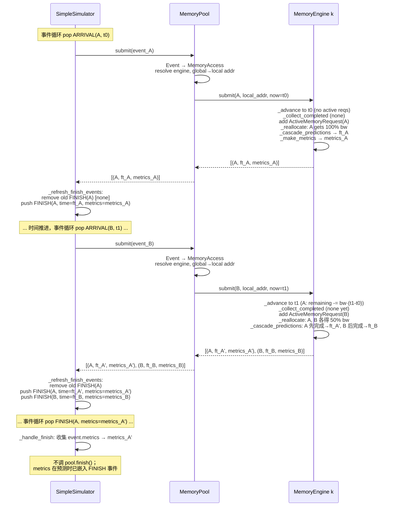

# 多实例管理与理论带宽竞争设计方案

## 1. 文档目的

本文给出 MemEngine 多实例管理和第一阶段访存竞争仿真的完整设计。

本阶段的目标是：

1. 将一个 `MemoryEngine` 明确定义为一个独立的物理介质实例。
2. 通过新的 `MemoryPool` 管理多个 `MemoryEngine`、全局地址和实例路由。
3. 支持多个上层服务实例（例如多个 prefill server）在不同 arrival time 发起访存。
4. 复用当前 Analytic 后端的带宽理论模型，实现事件驱动的动态带宽分配。
5. 向父项目的离散事件仿真器提供与具体事件框架无关的接口。
6. 保留现有单实例同步 `MemoryEngine.issue_request()` 的使用方式。

本阶段不考虑：

- Ramulator/MQSim 的跨调用竞争或在线增量仿真。
- 一个 tensor 跨多个实例进行 stripe 放置。
- 数据复制、迁移、remote access 或缓存一致性。
- PCIe switch、网络、计算单元等多级共享资源的精确流水和仲裁；第一阶段只允许将瓶颈折叠为 Engine 或 Pool 的一个带宽资源。
- 在本仓库内实现完整的全局离散事件循环。

## 2. 核心设计结论

### 2.1 层级划分

- `MemoryEngine`：单个物理介质实例，直接持有带宽竞争状态（`active_requests`、`last_update_time`、均分带宽、cascade 预测）。不维护独立的预测缓存或事件指标——预测在每次 `submit()` 时从头重算，最终统计由 Simulator 持有。
- `MemoryPool`：多实例地址和路由管理层，`submit(event)` 接受 `Event` 对象，内部解析 engine、global→local 地址转换、透传预测结果。不做任何统计。Simulator 不直接接触 engine。
- `SimpleSimulator`：事件堆管理 + 最终统计——下发 ARRIVAL、接收预测并替换 FINISH、FINISH 触发时从 `event.metrics` 收集 `MemoryRequestMetrics`。聚合 makespan 和 per-source 指标。

### 2.2 从 MemoryEngine 移出的职责

多实例改造完成后，下列职责不再属于 `MemoryEngine`：

- `dp_size` 和 DP 请求复制。
- `storage_instance_num`。
- 跨实例 round-robin。
- 池级全局地址空间。
- 池级全局请求计数。

DP 语义应由上层 workload 或父项目服务拓扑表达；多实例数量、地址空间和请求路由由 `MemoryPool` 表达。

### 2.3 地址语义

- 直接调用 `MemoryEngine` 时，地址是该实例的 local byte address。
- 通过 `MemoryPool` 调用时，地址始终是 pool global byte address。
- `MemoryPool.submit()` 可以选择性携带 `mem_engine_id`，但该参数只用于直接定位和归属校验，不改变 `addr` 的 global address 语义。
- 未指定 `mem_engine_id` 时，根据 global address 所在的实例地址窗口进行确定性路由。
- 实例选择发生在数据分配时，而不是每次访问时，避免同一个地址被动态发送到不同实例。

## 3. 整体架构图

```mermaid
flowchart TB
    subgraph SERVICE["上层服务实例"]
        P0["Prefill Server 0"]
        P1["Prefill Server 1"]
        PN["Prefill Server N"]
    end

    subgraph PARENT["父项目离散事件仿真器"]
        DES["SimpleSimulator (或父项目 DES)<br/>事件队列、逐个下发 ARRIVAL、<br/>接收 FINISH 事件列表并替换"]
        ARRIVE["Arrival Events"]
        FINISH["Finish Events (with embedded metrics)"]
        ARRIVE --> DES
        FINISH --> DES
    end

    subgraph POOL_LAYER["MemoryPool：多实例系统层"]
        API["submit(event) / get_tensor_addr"]
        ADDR["Global Address Windows<br/>Allocation Policy"]
        ROUTER["Global -> Engine ID + Local Address"]
        API --> ADDR
        ADDR --> ROUTER
    end

    subgraph ENGINE_LAYER["MemoryEngine：单实例层"]
        E0["MemoryEngine 0<br/>local allocator, active requests,<br/>bandwidth state, predictions"]
        E1["MemoryEngine 1<br/>local allocator, active requests,<br/>bandwidth state, predictions"]
        EM["MemoryEngine M<br/>local allocator, active requests,<br/>bandwidth state, predictions"]

        B0["Analytic / Ramulator / MQSim backend 0"]
        B1["Analytic / Ramulator / MQSim backend 1"]
        BM["Analytic / Ramulator / MQSim backend M"]

        E0 --> B0
        E1 --> B1
        EM --> BM
    end

    P0 --> DES
    P1 --> DES
    PN --> DES
    DES --> API
    ROUTER --> E0
    ROUTER --> E1
    ROUTER --> EM
    E0 -.->|[(rid, ft, metrics)]| API
    E1 -.->|[(rid, ft, metrics)]| API
    EM -.->|[(rid, ft, metrics)]| API
```

每个 Engine 独立管理自己的带宽竞争状态。第一阶段只有 Analytic backend 接入事件驱动路径，Ramulator 和 MQSim 保持同步 batch 模式。TODO(phase-2): POOL scope（共享带宽）。

## 4. 模块职责

| 模块 | 核心职责 | 不负责的内容 |
| --- | --- | --- |
| `MemoryEngine` | 单实例 local 地址分配、容量校验、backend 生命周期；直接持有事件驱动的带宽竞争状态（`_advance`、`_collect_completed`、`_reallocate`、`_cascade_predictions`）；不维护预测缓存或事件指标 | 多实例数量、跨实例路由、DP 复制、事件队列、最终统计 |
| `MemoryPool` | 实例集合、global 地址窗口、分配策略、global→local 转换、`submit(event)` 路由（校验→resolve→forward）；不做统计 | DRAM/NAND 细节、引擎内部带宽状态、事件队列管理、指标聚合 |
| `SimpleSimulator` | 管理事件堆（ARRIVAL/FINISH）、逐个下发 ARRIVAL、接收预测并增量替换 FINISH（按 `request_id` 匹配）、FINISH 触发时直接收集 `event.metrics`、聚合 makespan 和 per-source 指标 | 地址映射、介质请求转换、engine 身份 |
| `memory_pool/event.py` | `Event` 和 `EventKind` 定义——放在 pool 侧使 Simulator 和 Pool 都能 import，避免循环依赖 | — |

## 5. 多实例和地址空间设计

### 5.1 固定全局地址窗口

第一阶段为每个 MemEngine 分配一个互不重叠的 global address window。

假设实例容量为 `C0`、`C1`、`C2`：

```text
MemEngine 0: global [0,       C0)
MemEngine 1: global [C0,      C0+C1)
MemEngine 2: global [C0+C1,   C0+C1+C2)
```

对于实例 `i`：

```text
global_addr = global_base[i] + local_addr
local_addr  = global_addr - global_base[i]
```

实例可以通过对窗口起始地址进行二分查找，或在同构等容量时通过除法快速定位。实现上优先使用统一的窗口表，以便以后支持异构容量。

### 5.2 地址分配

池级接口：

```python
def get_tensor_addr(
    self,
    size_bytes: int,
    *,
    mem_engine_id: int | None = None,
) -> int:
    """Allocate a tensor and return its pool-global byte address."""
```

处理流程：

1. 如果指定 `mem_engine_id`，选择对应实例。
2. 如果未指定，由 pool allocation policy 选择实例。
3. 调用目标 `MemoryEngine.get_tensor_addr()` 分配 local address。
4. 将 local address 转换为 global address 并返回。

第一阶段建议支持以下 placement policy：

```python
class AllocationPolicy(Enum):
    ROUND_ROBIN = "round_robin"
    LEAST_ALLOCATED = "least_allocated"
```

推荐默认使用 `LEAST_ALLOCATED`，并在选择时跳过剩余容量不足的实例。策略比较的是已分配容量，而不是瞬时活跃带宽，保证数据 placement 可复现且不会随访问时序改变。

### 5.3 为什么不需要 MemoryRegion

第一阶段规定：

- 一个 allocation 完整落在一个 MemEngine。
- 一次访问不能跨越两个实例的 global window。
- 不支持 stripe、迁移或副本。

因此仅使用 global/local address 和固定窗口即可，不需要 `MemoryRegion`、`MemoryRegionSegment` 或地址片段表。如果后续支持跨实例 stripe，再单独引入这些结构。

### 5.4 地址访问校验

`MemoryPool.submit()` 必须校验每个 arrival 的地址：

- `addr >= 0`。
- `size_bytes > 0`。
- `[addr, addr + size_bytes)` 完整位于某个实例窗口内。
- 如果指定 `mem_engine_id`，地址窗口必须属于该实例。
- local address 转换后不能超过实例容量。

不允许指定一个实例 ID，却用另一个实例窗口中的地址静默访问。

### 5.5 一个请求只访问一个存储节点

第一阶段中，MemoryPool 的策略是数据 placement 策略，而不是每次访问时的负载均衡策略：

```text
一次 allocation      -> 一个 MemoryEngine
一次 memory request  -> 数据所属的一个 MemoryEngine
```

请求不会因为当前实例繁忙而动态发送到其他实例。只有后续显式支持 stripe、数据副本或迁移时，一个逻辑请求才可能拆分到多个存储节点。

### 5.6 介质带宽与传输带宽

请求可能受介质带宽或传输链路带宽限制。第一阶段采用折叠后的有效峰值带宽：

```text
B_effective = min(B_media, B_transport)
```

如果 `B_media >> B_transport`，则竞争主要发生在传输资源上，没有必要模拟复杂的介质内部调度。

- 每个 MemEngine 有独立链路时，每个 Engine 使用自己的 `B_effective` 并独立维护 active request。
- 多个 MemEngine 共享同一链路时，应在 Pool 层共享带宽竞争状态；不同 Engine 上的请求竞用同一传输带宽。

每个 Engine 拥有独立的带宽资源。TODO(phase-2): 如果目标硬件共享传输链路，需引入 POOL scope。

## 6. 核心数据结构和接口

### 6.1 MemoryAccess

父项目提交给 MemoryPool 的逻辑访问：

```python
@dataclass(frozen=True)
class MemoryAccess:
    request_id: str
    source_id: str
    addr: int
    size_bytes: int
    req_type: MemoryRequestType
    mem_engine_id: int | None = None
    # TODO(phase-2): add weight field for weighted bandwidth sharing
```

字段语义：

- `request_id`：父项目范围内唯一，用于完成回调、取消和指标关联。
- `source_id`：访问来源，例如 `prefill-0`、`prefill-1`。
- `addr`：Pool API 中始终是 global byte address。
- `mem_engine_id`：可选的实例约束；未指定时按地址解析。

arrival time 不放入 `MemoryAccess`，由父项目事件和 `submit(now=...)` 参数表达。

### 6.2 MemoryRequestMetrics

每次预测时预计算并嵌入返回值的单请求指标：

```python
@dataclass(frozen=True)
class MemoryRequestMetrics:
    request_id: str
    source_id: str
    mem_engine_id: int
    arrival_time: float
    finish_time: float
    size_bytes: int
    latency: float
    standalone_time: float
    contention_delay: float
    average_bandwidth: float
```

其中：

```text
latency           = finish_time - arrival_time
standalone_time   = size_bytes / B_effective
contention_delay  = latency - standalone_time
average_bandwidth = size_bytes / latency
```

### 6.3 事件驱动接口：逐 ARRIVAL 下发，全量预测返回

Simulator 直接传 `Event` 给 Pool。Pool 内部构造 `MemoryAccess` 并转发给 engine。Engine 每次 submit
从头重算全部活跃请求的预测（cascade 模型），每个预测携带预计算的 metrics：

```
Simulator                       Pool                              Engine
─────────                       ────                              ──────
pool.submit(event)          →  构造 MemoryAccess                  
                               resolve engine → submit(access, local, event.time)
                               global→local addr                    ├─ _advance 到 event.time
                                                                    ├─ _collect_completed（pop 已完成）
                                                                    ├─ add ActiveMemoryRequest
                                                                    ├─ _reallocate（均分带宽）
                                                                    ├─ _cascade_predictions（逐段推进）
                               ← [(rid,finish,metrics), ...]  ←  返回全量预测
  ↓
_refresh_finish_events:
  遍历每条 (rid, finish, metrics)：
    删除同 rid 的旧 FINISH，推入新 FINISH（metrics 嵌入事件）
```

**全量预测语义**：
- 每次 `submit()` 返回**所有**活跃请求的最新 `(rid, finish_time, metrics)` 三元组，包括新请求自身。
- Cascade 模型模拟请求按"谁先完成"顺序逐段推进，完成后带宽归还给剩余请求——预测值准确，无需 finish-time 回调。
- Simulator 逐条处理返回的 entries：删除同 `request_id` 的旧 FINISH，推入新 FINISH。

**FINISH 事件携带 metrics**：`MemoryRequestMetrics` 在 engine 预测时预计算，随 `submit()` 返回值一路传出，Simulator 直接嵌入 `Event.metrics`。FINISH 触发时 `_handle_finish` 直接读取 `event.metrics`，不需要再调 `pool.finish()`。被替换掉的 FINISH，其 metrics 随事件一并丢弃。

### 6.4 Pool 的 submit 接口

```python
def submit(self, event: Event) -> list[tuple[str, float, MemoryRequestMetrics]]:
    """返回 [(request_id, finish_time, metrics), ...] — 全部活跃请求"""
```

`now` 直接从 `event.time` 取出，不需要额外参数。Pool 不设 `finish()`。

## 7. 基于当前 Analytic 后端实现动态竞争

### 7.1 复用而不是重写

当前 Analytic 后端的核心公式是：

```text
total_time = total_bytes / configured_bandwidth
```

事件驱动模型使用同一公式和同一带宽配置（`media_system.effective_bandwidth`），只增加跨事件状态。不需要独立的 model 类——`AnalyticMediaSystem` 直接暴露 `effective_bandwidth`，engine 和 batch 路径共用同一个 `media_system` 实例读取带宽。

### 7.2 引擎内部状态

Engine 直接在实例上维护带宽竞争状态，不设独立的事件队列类，不维护预测缓存或事件指标：

```python
class MemoryEngine:
    _active_requests: dict[str, ActiveMemoryRequest]
    _last_update_time: float
    _runtime_mode: str | None

@dataclass
class ActiveMemoryRequest:
    access: MemoryAccess
    local_addr: int
    mem_engine_id: int
    arrival_time: float
    remaining_bytes: float
    allocated_bandwidth: float = 0.0
    transferred_bytes: float = 0.0
```

预测每次从 `_active_requests` 重算，不需要 `_predictions` 缓存。最终统计由 Simulator 的 `request_metrics` 持有，engine 不做事件指标累积。

### 7.3 动态带宽推进与 cascade 预测

每次 `submit(access, local_addr, now=t)` 时：

1. **advance 到 t**：`delta = t - last_update_time`，对所有活跃请求 `transferred = allocated_bw × delta`，`remaining_bytes -= transferred`，`transferred_bytes += transferred`。
2. **_collect_completed**：遍历 `_active_requests`，pop 掉 `remaining_bytes ≤ epsilon` 的请求（不再构造 metrics）。
3. **加入新请求**：校验 `request_id` 不重复，创建 `ActiveMemoryRequest` 加入 `_active_requests`。
4. **均分带宽**：`_reallocate()` → `share = effective_bandwidth / len(active)`，分配给所有活跃请求。
5. **_cascade_predictions**（纯计算，无副作用）：
   - 复制每个请求的 `remaining_bytes` 和 `allocated_bandwidth`
   - 按"谁先完成"排序，逐段推进：
     - 找到 `earliest = min(remaining / share)`
     - 推进 `sim_time += earliest`，所有请求消耗相应字节
     - 弹出完成者，记录 `finish_time`
     - 重新均分带宽给剩余请求，循环
   - 返回 `{rid: finish_time}`
6. **生成 metrics 并返回**：遍历 `_active_requests`，用 cascade 结果和 `_make_metrics` 生成 `[(rid, finish_time, metrics), ...]`。

Cascade 模型使预测值准确反映"先完成者的带宽归还给后完成者"，无需 finish-time 回调 engine。

### 7.4 带宽共享

第一阶段固定均分：`share = peak / n`，直接写在 engine 的 reallocate 逻辑中。

TODO(phase-2): 加权分配、source-fair 分配（需在 `MemoryAccess` 中增加 `weight` 字段）。

### 7.5 理论不变量

实现应至少满足：

1. 单请求无竞争：

   ```text
   completion - arrival = bytes / peak_bandwidth
   ```

2. 所有请求同时到达且模型 work-conserving：

   ```text
   final_makespan = sum(all_bytes) / peak_bandwidth
   ```

   该结果应与当前 Analytic batch 后端一致。

3. 任意非空 active 集合：

   ```text
   sum(allocated_bandwidth_i) = peak_bandwidth
   ```

   允许浮点误差。

4. `remaining_bytes` 不得为负。
5. arrival time、finish time 和 `last_update_time` 必须单调不减。

## 8. 上层离散事件调用流程

### 8.1 整体事件关系时序图



**三层隔离**：
- **SimpleSimulator**：管理事件堆（ARRIVAL / FINISH）。ARRIVAL 时直接传 `Event` 给 `pool.submit(event)` → `_refresh_finish_events()` 用新预测替换旧 FINISH（按 `request_id` 匹配）。FINISH 时直接从 `event.metrics` 收集指标，不调 pool。
- **Pool**：接收 `Event` → 构造 `MemoryAccess` → `_validate_access` + `resolve_engine()` → `global→local` → `engine.submit()` → 透传返回值。不做统计、不做 stale 检测。
- **Engine**：`submit()` 流程：① `_advance` ② `_collect_completed`（仅 pop） ③ add ④ `_reallocate` ⑤ `_cascade_predictions`（逐段推进，完成者带宽归还） ⑥ `_make_metrics`。返回 `[(rid, finish_time, metrics), ...]`。不维护预测缓存，不累积事件指标。

**关键设计点**：
- **Cascade 预测**：模拟请求按完成顺序逐段推进，带宽在完成时自动归还——无需 finish-time 回调 engine。
- **无 gen 计数器**：stale 检测通过 `request_id` 匹配实现——`_refresh_finish_events` 删除同 `request_id` 的旧 FINISH，推入新预测。
- **Metrics 嵌入 FINISH 事件**：`MemoryRequestMetrics` 在 engine 预测时预计算，Simulator 将其嵌入 FINISH 事件。FINISH 触发时直接读取，无需回调。
- **Engine 不做统计**：最终统计完全由 Simulator 的 `request_metrics` 持有，engine 不累积事件指标。

### 8.2 初始化

```python
pool = MemoryPool.from_homogeneous(
    instance_count=4,
    engine_config=engine_config,
    allocation_policy=AllocationPolicy.LEAST_ALLOCATED,
    # TODO(phase-2): sharing_policy parameter (weighted, source-fair)
)
```

### 8.3 分配数据

```python
addr = pool.get_tensor_addr(kv_size_bytes)
addr = pool.get_tensor_addr(kv_size_bytes, mem_engine_id=2)
```

### 8.4 父项目事件处理伪代码

```python
class SimpleSimulator:
    def __init__(self, pool):
        self._pool = pool
        self._heap: list[tuple[float, int, Event]] = []
        self._seq = 0
        self._request_metrics: list[MemoryRequestMetrics] = []

    def _handle_arrival(self, event):
        # 直接传 Event，pool 内部构造 MemoryAccess
        entries = self._pool.submit(event)
        self._refresh_finish_events(entries)

    def _refresh_finish_events(self, entries):
        for request_id, finish_time, metrics in entries:
            # 按 request_id 删除旧 FINISH，重建堆
            self._heap = [
                e for e in self._heap
                if not (e[2].kind is EventKind.FINISH
                        and e[2].request_id == request_id)
            ]
            heapq.heapify(self._heap)
            # 推入新 FINISH，metrics 直接嵌入事件
            self._seq += 1
            ev = Event(
                time=finish_time, seq=0, kind=EventKind.FINISH,
                source_id="", request_id=request_id,
                mem_engine_id=0, addr=0, size_bytes=0,
                req_type=MemoryRequestType.KREAD,
                metrics=metrics,
            )
            heapq.heappush(self._heap, (ev.time, self._seq, ev))

    def _handle_finish(self, event):
        if event.metrics is not None:
            self._request_metrics.append(event.metrics)
```

### 8.5 Engine 内部状态管理

`submit(access, local_addr, now=t)` 的完整流程：

1. **_advance(t)**：所有活跃请求 `remaining_bytes -= allocated_bw * (t - last_update_time)`。
2. **_collect_completed()**：pop 掉 `remaining_bytes ≤ epsilon` 的请求（不构造 metrics，不累积事件指标）。
3. **加入新请求**：校验 `request_id` 不重复，创建 `ActiveMemoryRequest` 加入 `_active_requests`。
4. **_reallocate()**：`share = effective_bandwidth / len(active)`，均分。
5. **_cascade_predictions(now, active, bw)** — 纯计算，无副作用：
   - 复制每个请求的 `remaining_bytes`，模拟逐段推进
   - 每次找到最早完成者 → 推进时间 → 所有请求消耗字节 → 弹出完成者，记录 `finish_time` → 带宽归还，均分给剩余请求
   - 返回 `{rid: finish_time}`
6. **生成 metrics 并返回**：对 `_active_requests` 中每个请求，用 cascade 结果生成 `MemoryRequestMetrics`，返回 `[(rid, finish_time, metrics), ...]`。

Engine 不维护预测缓存（`_predictions` 已删除），不累积事件指标（`_event_metrics` 已删除）。最终统计在 Simulator 的 `request_metrics` 中。

## 9. 同步接口与事件接口的关系

### 9.1 保留单实例同步兼容

现有调用保持：

```python
engine = MemoryEngine(engine_config)
addr = engine.get_tensor_addr(size)
metrics = engine.issue_request([addr], [size], [req_type])
```

同步 `issue_request()` 使用 local address，调用现有 backend batch 模式，不产生 arrival 或 active request 竞争状态。

### 9.2 禁止混用运行模式

同一个仿真 session 中同一 engine 不应混用：

- `issue_request()`（同步执行）；
- `pool.submit()` / `engine.submit()`（事件驱动执行）。

首次调用锁定该 engine 的 runtime mode（sync / event），混用抛 `RuntimeError`。

## 10. 指标设计

Engine 只维护同步路径的 `MemoryEngineMetrics`（`issue_request` 的累计指标）。事件路径不做引擎侧统计——最终指标完全由 Simulator 持有：

- **`MemoryRequestMetrics`**：单个完成请求的指标，在 engine 预测时预计算，嵌入 FINISH 事件。Simulator 在 FINISH 触发时收集到 `SimulationResult.request_metrics`。
- **`SimulationResult`**：`run()` 的输出，包含全部 `request_metrics`、per-source 聚合（avg_latency、avg_contention_delay、total_bytes、count）、makespan。

Pool 和 Engine 都不维护事件路径的累计计数器（`MemoryPoolMetrics`、`EngineEventMetrics`、`BandwidthAllocation` 均已删除）。

## 11. 对当前代码的改动

### 11.1 `memory_engine.py`

主要改动：

- 删除 DP 展开和 `storage_instance_num` round-robin。
- 地址空间改为单实例 local address。
- 保留 `get_tensor_addr()`、`issue_request()`（同步路径）和 `media_system`。
- 增加 `instance_id`、`global_base` 等由 Pool 注入的实例元数据。
- 事件驱动状态：`submit(access, local_addr, now)` → advance → collect_completed → add → reallocate → cascade_predictions → 返回 `[(rid, finish_time, metrics), ...]`。
- `_cascade_predictions` 纯计算函数，模拟逐段推进和带宽归还，O(n²) 复杂度。
- 删除 `_predictions`（预测缓存）、`_event_metrics`（事件指标）、`get_event_metrics()`。
- `_collect_completed` 简化为仅 pop，不构造 metrics。
- `_enter_runtime_mode` 锁定 sync/event 模式，混用抛 `RuntimeError`。

### 11.2 `memory_config.py`

建议：

- 从 `MemoryEngineConfig` 移除或弃用 `dp_size`。
- 从 `MemoryEngineConfig` 移除或弃用 `storage_instance_num`。
- `capacity` 明确定义为单实例容量。
- 增加 `MemoryPoolConfig`：实例数量、allocation policy。
- 增加 media bandwidth、transport bandwidth 和 effective bandwidth 的明确配置与派生。

兼容迁移可以分两步：

1. 暂时保留旧字段，只允许值为 1，并发出 deprecation warning。
2. 文档和配置迁移完成后删除字段。

### 11.3 `memory_pool/pool.py`

包含：

- `MemoryPool`：global address window 构建和查找、`get_tensor_addr()`、`submit(event)`（接收 Event，构造 MemoryAccess，校验，转发）。
- 同构实例 factory `from_homogeneous`。
- 不设 `issue_request()`、不设 `get_pool_metrics()`、不做统计。

### 11.4 新增数据契约

`memory_pool/memory_access.py`：

- `MemoryAccess`：逻辑访问数据契约，由 Pool 从 Event 构造。
- `ActiveMemoryRequest`：Engine 内部的可变状态（remaining_bytes、allocated_bandwidth）。
- `MemoryRequestMetrics`：单个完成请求的指标，在预测时预计算。

`memory_pool/event.py`：

- `Event`、`EventKind`——放在 pool 侧避免循环依赖（`des → pool` 允许，反向禁止）。
- `des/event.py` 重导出，保持现有 import 路径兼容。

### 11.5 事件驱动竞争实现

带宽竞争状态（`active_requests`、`_advance`、`_collect_completed`、`_reallocate`、`_cascade_predictions`）内置于 `MemoryEngine`。带宽固定均分（`peak / n`）。TODO(phase-2): 可配置带宽分配策略。

### 11.7 `memory_metrics.py`

- `MemoryEngineMetrics` 单实例累计口径（同步路径）。
- `MemoryRequestMetrics` 在 `memory_pool/memory_access.py` 中定义。
- 删除 `EngineEventMetrics`、`SourceTrafficMetrics`、`MemoryPoolMetrics`、`InstanceMetricsSummary`、`BandwidthAllocation`。

### 11.8 `run.py`

- `instances=1` 时仍可直接创建 `MemoryEngine`，或统一创建单实例 `MemoryPool`。
- `instances>1` 时创建 `MemoryPool`，不能再将实例数传给单个 Engine。
- 状态栏显示单实例容量、pool 总容量、allocation policy。
- KV workload 通过 Pool 分配 global address 后提交。

### 11.9 workload

KV workload generator 仍只负责生成 byte address、byte size 和 request type，不直接依赖 contention 或 backend。

需要调整的是调用位置：

- 单实例测试继续使用 local address 和 `MemoryEngine`。
- 池化 workload 使用 `MemoryPool.get_tensor_addr()` 返回的 global address。
- DP 复制若仍需要，由父项目或 workload 调用层显式生成。

### 11.10 Ramulator/MQSim

第一阶段不修改竞争行为：

- wrapper 接口保持 batch 模式。
- 不向它们连续注入带 arrival time 的请求。
- 不基于多次独立调用推导 native 竞争。
- event-driven `submit()` 遇到非 Analytic backend 时抛出明确的 `NotImplementedError` 或能力错误。

## 12. 配置语义调整

建议的新配置概念：

```json
{
  "pool": {
    "instances": 4,
    "allocation_policy": "least_allocated"
  },
  "engine": {
    "media_type": "analytic",
    "capacity_per_instance_gib": 32.0,
    "media_bandwidth_per_instance_gib_s": 400.0,
    "transport_bandwidth_per_instance_gib_s": 100.0
  }
}
```

关键变化：

- 容量、media bandwidth 和独立 transport bandwidth 是 per-instance 参数。
- 默认有效带宽为 `min(media bandwidth, transport bandwidth)`。
- pool 总容量由实例容量求和。
- Pool shared link 模式下使用 Pool 级传输带宽，不能为每个实例复制一份共享带宽。
- 旧配置 `instances=1` 可自动迁移。
- 旧配置若 `instances>1`，当前 `capacity` 曾表示总容量，不能静默解释为单实例容量；应要求用户明确给出 `capacity_per_instance_gib`，或者由兼容加载器按旧口径除以实例数并打印醒目警告。

## 13. 测试方案

### 13.1 MemoryEngine 单实例回归

- 地址对齐和容量溢出。
- 单请求和多请求 batch Analytic 结果不变。
- Ramulator/MQSim 现有单实例测试不受影响。
- `dp_size`、`storage_instance_num` 弃用行为符合预期。

### 13.2 MemoryPool 地址测试

- 同构和异构容量窗口。
- 指定实例分配。
- 未指定实例的 round-robin/least-allocated。
- global/local 地址转换。
- 地址恰好位于窗口边界。
- 请求跨窗口时拒绝。
- 指定错误 `mem_engine_id` 时拒绝。
- 所有实例容量不足时给出清晰异常。

### 13.3 动态带宽测试

- 单请求结果等于当前 Analytic。
- 所有请求同时到达时 final makespan 等于总字节除以峰值带宽。
- 第二个请求到达前，第一请求按全带宽推进。
- 新 ARRIVAL 到达后带宽均分，预测完成时间推迟。
- submit 返回全部活跃请求的预测 `[(rid, finish_time, metrics), ...]`。
- 多个同时间 arrival 与调用顺序无关。
- 浮点边界下 remaining bytes 不为负。
- advance + _collect_completed 自动清理已完成请求。

### 13.4 多实例竞争测试

- 不同实例上的请求互不影响。
- 同一实例、不同 source 的请求发生带宽竞争。
- 每个实例有独立的 `last_update_time` 和 active request 状态。
- TODO(phase-2): Pool shared link 下不同实例请求竞争同一带宽。
- pool metrics 等于各实例统计的正确聚合。

### 13.5 父项目接口契约测试

使用 `SimpleSimulator` 验证：

1. 逐个 `schedule_arrival()` 后 `sim.run()` 返回正确的结果。
2. `pool.submit()` 返回正确的 `[(rid, finish_time, metrics), ...]`。
3. 新 ARRIVAL 后旧 FINISH 按 `request_id` 匹配被正确替换。
4. FINISH 触发时从 `event.metrics` 直接收集，不调 pool。
5. 同一 engine 上混用 `engine.submit()`（事件）和 `engine.issue_request()`（同步）抛 `RuntimeError`。
6. `memory_pool` 不 import `des`。

## 14. 建议实施阶段

### 阶段一：单实例职责清理

- 清理 `MemoryEngine` 的 DP 和伪多实例逻辑。
- 保持单实例同步 API。
- 明确单实例容量和指标口径。

### 阶段二：MemoryPool

- 实现固定 global address window。
- 实现实例分配和 global/local 转换。
- 实现池级 `submit()` 事件接口。
- 实现 pool metrics。

### 阶段三：事件驱动竞争

- 在 `MemoryEngine` 中实现 `_advance`、`_collect_completed`、`_reallocate`、`_cascade_predictions`。
- 带宽固定均分（`peak / n`）。
- Cascade 模型：逐段推进，完成者带宽归还，无需 finish-time 回调。
- `SimpleSimulator` 管理 FINISH 事件堆，按 `request_id` 匹配替换旧预测，FINISH 触发时从 `event.metrics` 收集。

### 后续阶段

- **可配置带宽分配策略**：在 `MemoryAccess` 中恢复 `weight` 字段，增加 `WeightedTransferShare` 和 `SourceFairShare`，通过 `sharing_policy` 配置项选择。
- POOL 作用域（共享带宽资源）：跨 engine 事件协调。
- 读写分别限速或共享/全双工策略。
- 请求取消和超时。
- 跨实例 stripe、迁移和副本。
- 带 arrival time 的 Ramulator/MQSim native trace。

## 15. 最终边界

本方案完成后：

- `MemoryEngine`：单介质实例，内部 `_advance` / `_collect_completed` / `_reallocate` / `_cascade_predictions`。对外只暴露 `submit(access, local_addr, now)`（返回 `[(rid, finish_time, metrics), ...]`）和同步 `issue_request()`。不维护预测缓存，不累积事件指标，不暴露 `finish()`。
- `MemoryPool`：实例路由、global→local 地址转换、`submit(event)` 纯转发（Event → MemoryAccess → validate → forward）。不做统计，不做 stale 检测。Simulator 不接触 engine。
- `SimpleSimulator`：只与 Pool 交互——`submit(event)` 返回 `[(rid, finish_time, metrics), ...]`，FINISH 触发时直接从 `event.metrics` 收集。聚合 makespan 和 per-source 指标。
- `Event` 和 `EventKind` 定义在 `memory_pool/event.py`，`des/event.py` 重导出。
- 第一阶段一个请求只访问数据所属的一个实例。
- 现有单实例同步 `issue_request()` 使用方式保留，与事件路径互斥。
